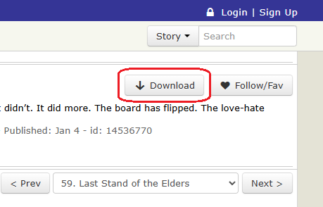

# FanFiction.net EPUB downloader

This is a Tampermonkey/Greasemonkey script that adds a download button to [fanfiction.net](https://www.fanfiction.net/) to allow downloading stories in EPUB format so they can be read on e-Readers or any other eBook reader of your choice.

# Supported platforms
| Browser                              | Windows, MacOS & Linux | Android | iOS |
|--------------------------------------|:----------------------:|:-------:|:---:|
|  Chrome   | ✅                     | ❌     | ❌  |
|  FireFox | ✅                     | ✅     | ❌  |
|  Edge     | ❔                     | ❔     | ❌  |


# Installation
1. Download either the [Tampermonkey](https://chromewebstore.google.com/detail/tampermonkey/dhdgffkkebhmkfjojejmpbldmpobfkfo?hl=en) (Chrome) or [Greasemonkey](https://addons.mozilla.org/en-US/firefox/addon/greasemonkey/) (Firefox) browser extension.
2. Click on [this link](https://github.com/brokeh/fanfiction.net-downloader/releases/latest/download/fanfiction.net-download.user.js) to add this script to Tampermonkey/Greasemonkey.


# Usage
### Desktop
On Windows, MacOS & Linux there's a new _"Download"_ button next to the existing _"Follow/Fav"_ button.<br/>


### Mobile (Android)
On Android there's a new download icon next to the _More_ dropdown in the toolbar.<br/>


Once clicked, you'll see a popup indicating the progress. The file will download shortly after every chapter has finished downloading.


# Design
### Troubles
FanFiction.net is hosted behind Cloudflare and use their [advanced bot protection](https://www.cloudflare.com/en-au/application-services/products/bot-management/).
This prevents naive scripts from being able to access the site at all even when passing the correct headers, as it detects the signature of the TLS handshake and cypher suites and compares it to the User Agent passed.
There are ways around this, such as with [cloudscraper](https://github.com/VeNoMouS/cloudscraper) which goes to great lengths to mimic the appearances of popular web browsers, but it's a constant game of cat-and-mouse.
The current version of cloudscraper can only pass the basic checks, and can sometimes get past the initial rate limiting verification, but fails to pass if the page requires the user to click "I am not a human" with the current Cloudflare challenges (as of Feb 2026).

Additionally, FanFiction.net has request rate limiting set to 20 requests/minute before attempting to verify that the user is a human by running some JavaScript to detect traits of the browser and user behaviour.

All of this adds up to making any sort of script that doesn't run inside the browser rather tricky and likely quite flaky as Cloudflare adapt and improve their detections and human verifications.


### Solution
A script that runs in the browser that will fetch as much as possible using browser APIs, and then when that starts to fail due to rate limiting, start embedding `iframe` elements into the webpage in a way where they are visible as far as the browser can tell and so it executes all JavaScript code as if the user is present, but not actually visible to the user because it is hiding behind other elements on the page.


# Development
## Prerequisites
This repository uses [Dev Containers](https://containers.dev/) to make building it easy. It's recommended to use [VS Code](https://code.visualstudio.com/) with the [Dev Containers](vscode:extension/ms-vscode-remote.remote-containers) extension.

If you don't want to use Dev Containers, then you will need to install:
* [Rust](https://rust-lang.org/tools/install/): I think it should work on version 1.85 and later. I only tested on 1.93, though.
* [wasm-pack](https://github.com/drager/wasm-pack): Installed with `cargo install wasm-pack` after Rust has been installed.
* [Python](https://www.python.org/downloads/): Any recent version should work. I only tested on 3.13.5, though.

To run the CI checks, you will also need:
* [Clippy](https://github.com/rust-lang/rust-clippy): Installed with `rustup component add clippy`.
* [PyLint](https://pypi.org/project/pylint/): Installed with `pip install pylint`.
* [npm](https://www.npmjs.com/) or some other Node package manager to be able to install EsLint.
* [EsLint](https://eslint.org/) version 10.0 & `@eslint/js`.


## Architectire
This User Script has 2 components

### 1. The template User Script
The [template.user.js](./user-script/template.user.js) file that is the base of what's installed into Tampermonkey/Greasemonkey.

This orchestrates the downloading of all the chapters, working around the Cloudflare blocks & limits and converts the entire story into a JSON object.

The template file can be loaded into Tampermonkey/Greasemonkey on its own and will download all the chapters and log the JSON object to the developer console, but it won't be able to convert it to an EPUB.

It has a few special `/* <<<EMBED something HERE>>> */` markers on the last few lines for places where the 

### 2. A WASM module that generates the EPUB file
The [json2epub](./json2epub/) Rust module converts the JSON representation of the story from the first component into an actual EPUB file.

It gets compiled as a [WASM](https://webassembly.org/) module that can be executed directly by the browser.

The resulting WASM module, as well as the JavaScript bindings to interface with it are then merged into the `template.user.js` at the appropriate `/* <<<EMBED something HERE>>> */` locations by the [generate.py](./user-script/generate.py) to produce the final `fanfiction.net-download.user.js`.


## Building the script
Once all prerequisites are installed, simply run the below from the root of this repository
```shell
./build.sh
```

Or if you're running on Windows and aren't using Dev Containers,
```shell
build.bat
```

That's it. It'll produce a `fanfiction.net-download.user.js` script in the [user-script/](./user-script/) folder once it has finished building everything that you can then upload to Tampermonkey/Greasemonkey.

To produce a build with a version number and auto-update URL filled in suitable for publishing to GitHub, run
```shell
./build.sh --publish <version>
```

## Running CI checks
To run the code quality & integrity checks, simply run
```shell
./check.sh
```


# TODO
* [ ] Better handling when the Cloudflare rate limiting requires the user to tick the box to indicate they're not a human. Detect the situation and make the `iframe` visible. Currently it times out after 1 minute and the rate limit is reset.
* [ ] Download chapters in parallel, both before and after the rate limit has been hit. The rate limit seems to be 20 requests/minute irresepective of how quick those requests are, so might as well blow through them quickly.
